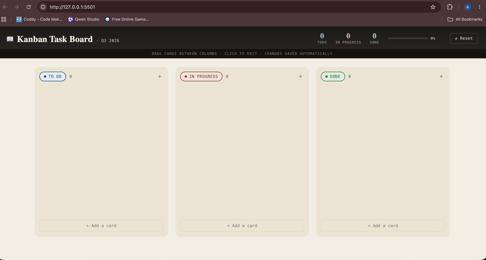
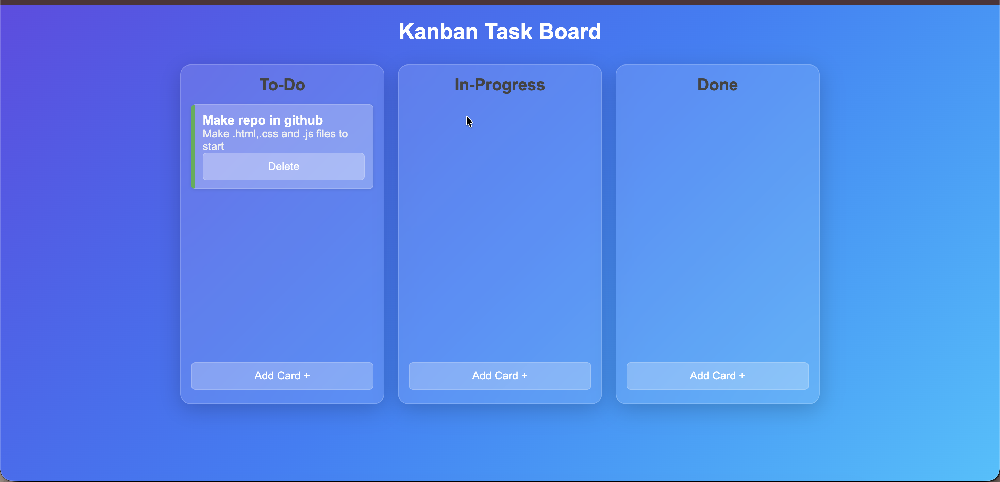
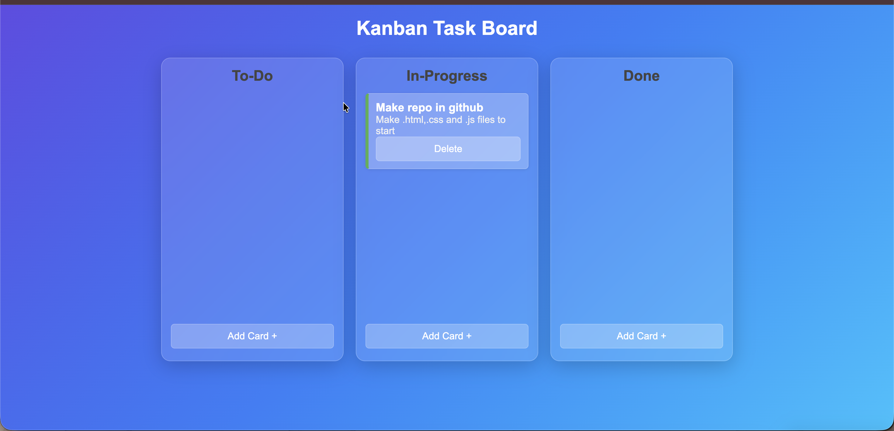

🚀 Kanban Task Board

A modern Trello-style Kanban Board built using HTML, CSS, and JavaScript. This application helps users organize tasks efficiently through an intuitive drag-and-drop workflow while maintaining complete board persistence using browser localStorage.

⸻

📌 Overview

The Kanban Task Board is designed to improve productivity by visually tracking tasks through different stages of completion.

The board consists of three workflow columns:

* 📝 To Do
* ⚡ In Progress
* ✅ Done

Users can create, edit, move, and delete tasks dynamically. All board data is automatically saved in localStorage, ensuring tasks remain available even after page refreshes.

⸻

✨ Features

📝 Task Management

* Create new tasks
* Edit existing tasks
* Delete tasks
* Move tasks between columns

🖱️ Drag & Drop Support

* Built using the HTML5 Drag and Drop API
* Smooth task movement between workflow stages
* Real-time board updates

💾 Persistent Storage

* localStorage integration
* Automatic data saving
* Board state restored after refresh

🎨 Modern User Interface

* Clean and responsive design
* Interactive task cards
* Organized workflow structure
* User-friendly experience

⚡ Dynamic Functionality

* Real-time DOM updates
* Event-driven interactions
* Efficient state management
* Seamless task tracking

⸻

🛠️ Technologies Used

Technology	Purpose
HTML5	Structure
CSS3	Styling
JavaScript (ES6)	Functionality
Drag & Drop API	Task Movement
localStorage	Data Persistence

⸻

📂 Project Structure

Kanban-Task-Board/
│
├── index.html
├── style.css
├── script.js
└── README.md

⸻

⚙️ How It Works

1. Create a task.
2. Task appears in the To Do column.
3. Drag the task into In Progress when work begins.
4. Move the task to Done once completed.
5. Every change is automatically saved in localStorage.
6. Refreshing the page restores the complete board state.

⸻

🔥 Key Highlights

* CRUD Operations
* HTML5 Drag & Drop API
* Dynamic DOM Manipulation
* localStorage Persistence
* Responsive Layout
* State Management
* Modern JavaScript Concepts
* Real-Time UI Updates

⸻

🎓 Learning Outcomes

This project demonstrates practical implementation of:

* DOM Manipulation
* Event Handling
* Drag & Drop API
* Browser Storage
* State Persistence
* CRUD Operations
* Responsive Web Design
* Modern JavaScript Development

⸻

🚀 Future Enhancements

* Task Priorities
* Due Dates
* Search & Filter Tasks
* Dark/Light Theme Toggle
* Multiple Boards
* Team Collaboration Features
* Cloud Database Integration

⸻

## 📸 Screenshots

### 🏠 Main Board

### ➕ Add Task Modal

### ✏️ Edit Task Modal

⸻

👨‍💻 Author

Abrar Sheikh

Developed as part of the Semester 2 JavaScript OJT Project to demonstrate advanced front-end development concepts including drag-and-drop interactions, task management, state persistence, and local storage integration.

⸻
Live Demo Link
https://abrarbuilds.github.io/Kanban-Task-Board/

📄 License

This project is created for educational and learning purposes.
